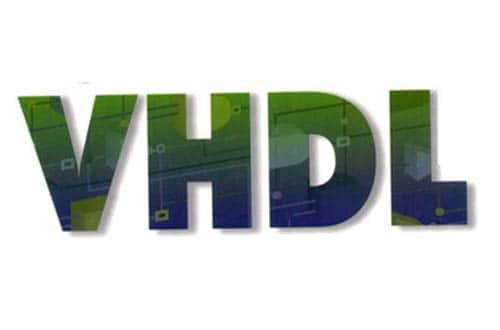

# Hi 
## I'm D.Ranjan
 ### Electronics and Communication Engineer
 ### Self-taught Desktop & Web Developer 

- 🔭 I’m currently working on a Qt/C++ Desktop App
- 🌱 I’m currently learning Qt/C++
- 💬 Ask me about anything related to CPP/Qt/AutoIt/Javascript 
**Or**
      EDC,Digital Electronics, Analog & Digital Communication, SDR

**Languages and Tools:** 

<code></code>
<code></code>
<code></code>
<code></code>
<code></code>
<code></code>
<code></code>
<code></code>
<code></code>
<code></code>
<code></code>
